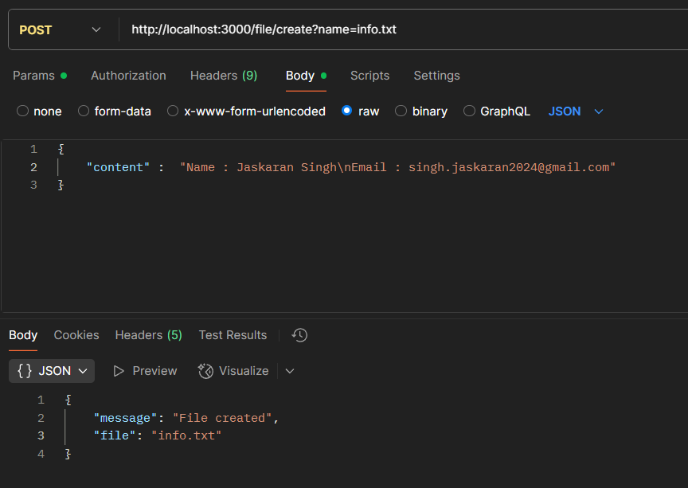
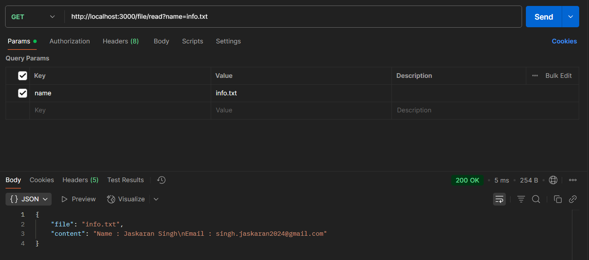
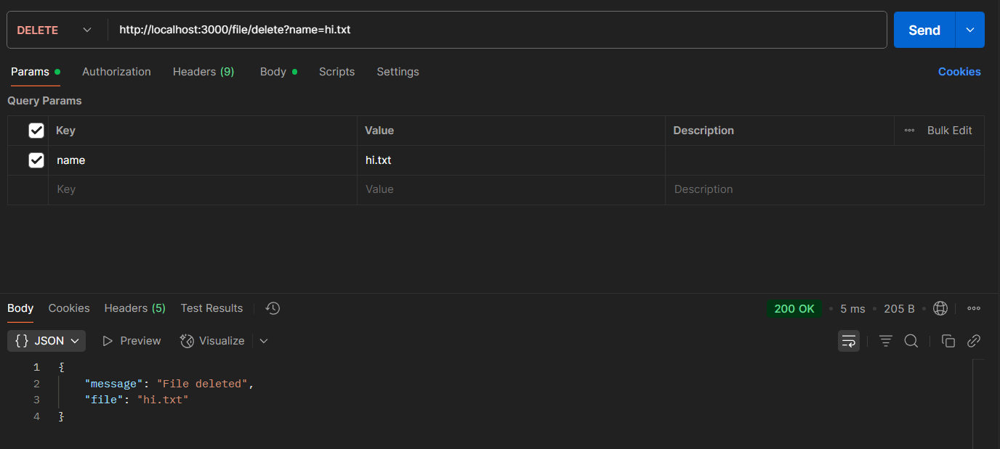

# Simple File Management HTTP Server in Node.js

This project is a simple HTTP server built with Node.js core modules that allows you to create, read, and delete files via HTTP requests.

---

## Features

- Create a file with content (POST)
- Read file content (GET)
- Delete a file (DELETE)
- Files are stored in a dedicated `files` folder inside the project directory
- Uses only Node.js core modules (`http`, `fs`, `path`)
- Clean separation of concerns with service and controller layers

---

## Project Structure

project-root/
│
├── controller/
│ └── file-controller.js # Route handling for file-related requests
│
├── service/
│ └── file-service.js # File system operations (create, read, delete)
│
├── utils/
│ └── index.js # Utility to ensure 'files' directory exists
│
├── files/ # Directory where files are stored (auto-created)
│
├── index.js # Main server entry point
│
└── README.md # Project documentation

project:
name: Simple File Management HTTP Server
description: >
A Node.js server using core modules (http, fs, path) to create, read, and delete files
through HTTP API endpoints.
version: 1.0.0

structure:

- controller/file-controller.js: Route handling for file operations
- service/file-service.js: Handles actual file system operations
- utils/index.js: Utility to ensure 'files' folder exists
- files/: Directory where files are stored
- index.js: Main server entry point
- README.md: Project documentation

prerequisites:

- Node.js version 14 or above

setup:
steps: - git clone <repository-url> - cd <repository-folder> - node index.js

server:

```
    url: http://localhost:3000
```

message: Server running at http://localhost:3000

api:
endpoints: - path: /file/create
method: POST
query: name=<filename>
headers:
Content-Type: application/json
body:
content: "Your file content"
curl: >
curl -X POST `http://localhost:3000/file/create?name=example.txt`
-H "Content-Type: application/json"
-d '{"content":"Hello world!"}' - path: /file/read
method: GET
query: name=<filename>
curl: >
curl -X GET `http://localhost:3000/file/read?name=example.txt` - path: /file/delete
method: DELETE
query: name=<filename>
curl: >
curl -X DELETE `http://localhost:3000/file/delete?name=example.txt`

http_status_codes:

- 200: OK - Successful operation
- 400: Bad Request - Missing filename or invalid data
- 404: Not Found - File does not exist
- 405: Method Not Allowed - Wrong HTTP method
- 500: Internal Server Error - Unexpected server error

notes:

- files folder is created automatically
- all files are stored inside the files/ directory
- file names are trimmed and validated
- server returns JSON responses
- tools like curl or Postman can be used for testing

### Screenshots ->

## To create a file:



## To read a file:



## To delete a file:


